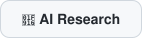
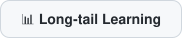
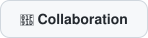
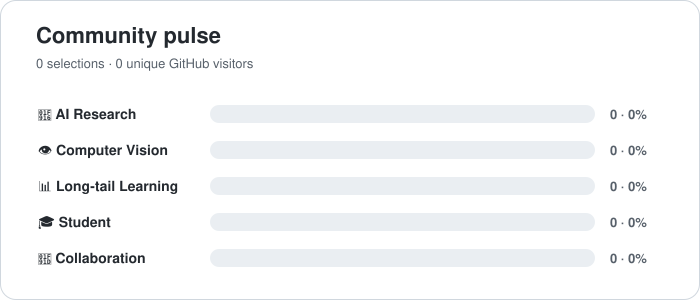

# Hi there 👋

Welcome to my GitHub profile.

## 🗳️ What brought you here?

Click one option below. Your choice will be recorded on GitHub and the statistics below will update automatically.

  
  &nbsp;
  
  &nbsp;
  
    
  
  &nbsp;
  

  

Each GitHub account is counted once per option. Votes are stored in this repository and updated by GitHub Actions.

